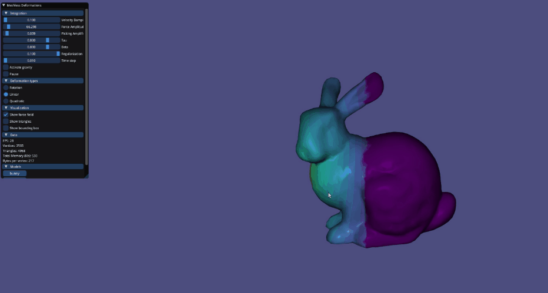

# Meshless Deformations Based on Shape Matching

Demo implementation of 
> Müller, M., Heidelberger, B., Teschner, M., AND Gross, M.
> 2005. Meshless Deformations Based on Shape Matching. (SIGGRAPH ’05). SIGGRAPH. https://matthias-research.github.io/pages/publications/MeshlessDeformations_SIG05.pdf



## Dependencies

- [Eigen](http://eigen.tuxfamily.org/index.php?title=Main_Page)
- [libigl](https://libigl.github.io/)
- [glad](https://glad.dav1d.de/)
- [glfw](https://www.glfw.org/)
- [c++11](https://en.cppreference.com/w/)
- [imgui](https://github.com/ocornut/imgui)

This project uses CMake for build configuration. `libigl` and `imgui` source with glfw integration have been embedded in the repo. `Eigen`, `glad` and `glfw` must be installed by the user and made available to the cmake build system generator by cmake `find_package` calls. Use [vcpkg](https://github.com/microsoft/vcpkg) to easily install these dependencies.

```
# if using vcpkg, install dependencies like this (preferably specify x64 target)
$ <vcpkg path>/vcpkg install eigen glad glfw

$ cd <repo path>
$ mkdir build
$ cd build
$ cmake -G "Your CMake Build System Generator" ..
# if using Visual Studio, you can open your .sln file now

$ cmake --build . # or build in VS IDE
```

## Usage

Generate force fields from your keyboard, pick object vertices to be fixed and pull on object vertices with mouse picking to play around with the model deformable objects. Customize the deformable object's behaviour by tweaking parameters in the `imgui` menu.

### User Interaction
#### Fixed vertices

While holding down the `shift` key, press the `left mouse button` while hovering your mouse cursor on the object to make the pointed-to object's vertex fixed (if it was free) or free (if it was fixed) in space.

#### Picking

While holding down the `ctrl` key, press the `left mouse button` when your mouse cursor points on the object and hover your mouse cursor around in the direction you want to pull the pointed-to object's vertex in space.

#### Force Fields

Generate force fields in the `up`, `down`, `left`, `right`, `forward` and `backward` directions from your keyboard using, respectively, the `i`, `k`, `j`, `l`, `space` and `b` keys.

### Parameter Configuration

