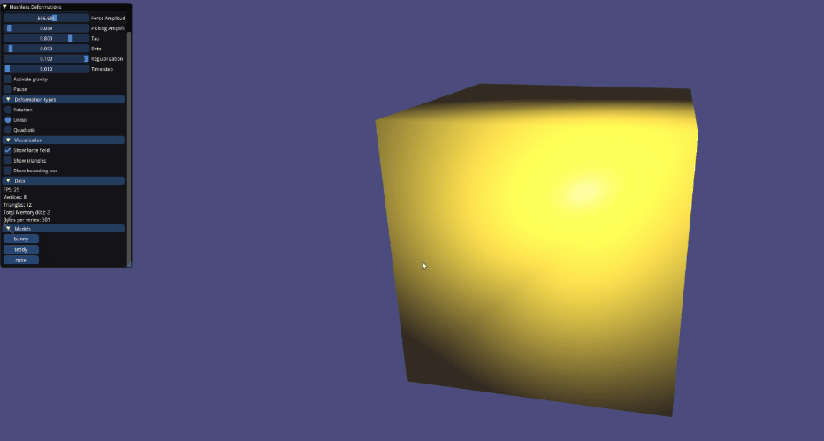

# Meshless Deformations Based on Shape Matching

Demo implementation of 
> Müller, M., Heidelberger, B., Teschner, M., AND Gross, M.
> 2005. Meshless Deformations Based on Shape Matching. (SIGGRAPH ’05). SIGGRAPH. https://matthias-research.github.io/pages/publications/MeshlessDeformations_SIG05.pdf




## Dependencies

- [libigl](https://libigl.github.io/)
- [c++17](https://en.cppreference.com/w/)
- [CMake](https://cmake.org)

## Building
```
$ git clone https://github.com/Q-Minh/meshless-deformation-based-on-shape-matching
$ cd meshless-deformation-based-on-shape-matching
$ cmake -S . -B build -A x64 -DCMAKE_BUILD_TYPE=Release

# if using Visual Studio, you can open your .sln file now
$ cmake --build build --target App --config Release # or build in VS IDE

# run app in ./build/Release or ./build
$ ./build/Release/App.exe # or ./build/App on linux/macos
```

## Usage

Generate force fields from your keyboard, pick object vertices to be fixed and pull on object vertices with mouse picking to play around with the model deformable objects. Customize the deformable object's behaviour by tweaking parameters in the `imgui` menu.

### User Interaction
#### Fixed vertices

While holding down the `shift` key, press the `left mouse button` while hovering your mouse cursor on the object to make the pointed-to object's vertex fixed (if it was free) or free (if it was fixed) in space.

#### Picking

While holding down the `ctrl` key, press the `left mouse button` when your mouse cursor points on the object and hover your mouse cursor around in the direction you want to pull the pointed-to object's vertex in space.

#### Force Fields

Generate force fields in the `up`, `down`, `left`, `right`, `forward` and `backward` directions from your keyboard using, respectively, the `i`, `k`, `j`, `l`, `space` and `b` keys.

### Parameter Configuration

Explanations to come.